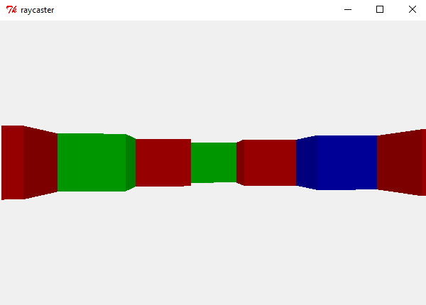

# raycaster-tk

This is a [ray casting](https://en.wikipedia.org/wiki/Ray_casting) engine written in Python. Old school pseudo-3D shooters like Wolfenstein 3D used this technology before computers could handle true 3D graphics. This Python implementation uses Tkinter for graphics and is able to run using only the Python standard library. I primarily used [this awesome ray casting tutorial](http://lodev.org/cgtutor/raycasting.html) to create this project.

